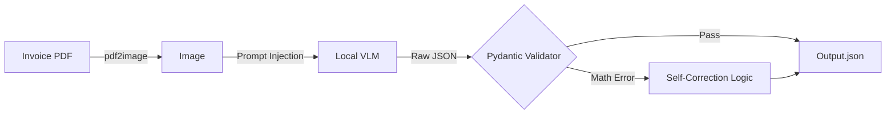

# AI Invoice Reconciliation Tool


> **Local AI Vision Pipeline for Automated Financial Data Extraction.**

---

## 📸 Demo


---

## 💼 The Challenge

Manual data entry from vendor invoices is slow and error-prone. While cloud-based AI solutions exist, they often raise privacy concerns and incur high per-document costs. I needed a solution that could extract structured data (line items, tax, totals) from unstructured PDF invoices entirely offline, without sending sensitive financial data to a third-party API.

## 🛠️ The Solution

I built a pipeline using a **Local Vision Language Model (VLM)** to act as an on-premise OCR engine. The system converts PDF invoices into images, feeds them to a local instance of an OpenAI-compatible model, and extracts a JSON object.

* **Few-Shot Prompting:** To improve accuracy, I implemented a dynamic prompt injector that feeds the model examples of *correctly* processed invoices similar to the current document.
* **Self-Correcting Logic:** AI isn't perfect. I used **Pydantic** to build a validation layer that acts as a safety net. It mathematically verifies the AI's output (e.g., ensuring `Quantity * Unit Price == Line Total`). If the AI "hallucinates" a math error, the Python logic overrides and corrects it automatically before saving.

---

## 🚀 Technical Highlights (The "Secret Sauce")

**The "Self-Correcting" Validator**
This Pydantic model demonstrates how I bridge the gap between probabilistic AI and deterministic business requirements. The `@model_validator` intercepts the AI's raw output and recalculates totals. If the AI reads a quantity of 1 but a shipping weight of 500lbs, the logic flags the discrepancy and calculates the likely true quantity based on unit cost, ensuring data integrity.

### Key Code Snippet

```python
# Pydantic Validator acting as a safety net for AI output
@model_validator(mode='after')
def calculate_and_verify_fields(self) -> 'InvoiceData':
    if self.line_items:
        calculated_subtotal = 0.0
        for item in self.line_items:
            # Fix quantity_ordered hallucination
            if item.quantity_ordered == 1.0 and item.quantity_shipped > 1.0:
                item.quantity_ordered = item.quantity_shipped

            if item.line_total is not None:
                calculated_subtotal += item.line_total

        # ALWAYS override totals with calculated values to prevent math errors
        self.subtotal = round(calculated_subtotal, 2)
        
    return self
```

---

## 🏗️ Architecture & Tech Stack

This application was built to be scalable and maintainable using the following technologies:

| Category | Technologies |
|----------|-------------|
| **AI/ML** | Local VLM (OpenAI-compatible API), PyTorch |
| **Validation** | Pydantic (Schema enforcement and self-correction) |
| **Processing** | PDF2Image, Pillow, PDFPlumber |

### Inference Pipeline


---

## 🔐 Licensing & Access

This software is a proprietary commercial product.

**Availability:**
* **Source Code:** Closed Source (Private Repository)
* **Deployment:** Docker Container or Standalone Executable
* **Data Privacy:** 100% Offline / On-Premise (No data sent to cloud APIs)

For consulting inquiries regarding Local AI implementation or to purchase a license, please contact me below.

---

## 📬 Contact

**Aaron** *Operations Manager turned Python Developer* Looking to automate your business operations?  
[View Portfolio Website](https://bearded1derer.github.io/) | [Connect on LinkedIn](https://www.linkedin.com/in/aaron-arpin-979a1354/)
